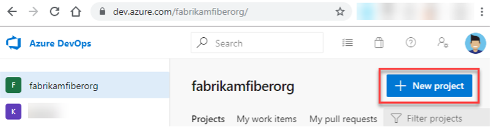
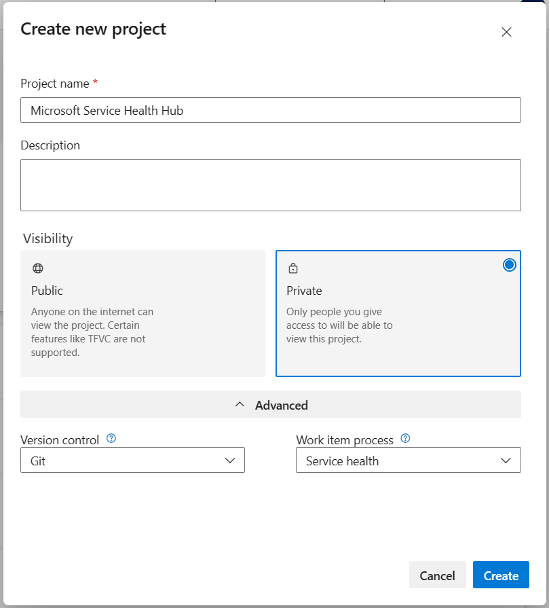

## Create an Azure DevOps project

A project provides a repository for work items that users can use to plan, track progress, and collaborate on work related to incidents and changes within Microsoft 365, Dynamics 365, Power Platform, and Azure.

These work items can be assigned to team members for further processing and tracking.

> **Prerequisites**
>
> - You need an Azure DevOps organization before you can create a project. If you have not created an organization yet, create one by following the instructions in:
>   - [Sign up, sign in to Azure DevOps](https://docs.microsoft.com/en-us/azure/devops/user-guide/sign-up-invite-teammates?view=azure-devops)
>   - [Create an organization or project collection](https://docs.microsoft.com/en-us/azure/devops/organizations/accounts/create-organization?view=azure-devops)
>
> - You must be a member of the **Project Collection Administrators** group, or you must have the **Create new projects** permission set to **Allow**.
>
>   If you are the Organization Owner, you are automatically added to the Project Collection Administrators group. If you are not a member, ask to be added.
>
>   For more information, see:
>
>   [Set permissions at the project or collection level](https://docs.microsoft.com/en-us/azure/devops/organizations/security/set-project-collection-level-permissions?view=azure-devops)

### Create the project

To create an Azure DevOps project:

1. Select **Azure DevOps** to open the **Projects** page.

2. Choose the organization, and then select **New project**.

   

3. Enter the required information in the form:

   - Provide a name for your project.
   - Set the project visibility to **Private**.
   - Expand **Advanced**.
   - Select the process created in the previous step.

   

4. Select **Private** visibility.

   With private visibility, only people you give access to can view the project.

   > If you choose public visibility, anyone on the internet can view your project.

5. Select **Create**.

   The project welcome page appears.

### Add the service principal to the project

After the project is created, grant the Service Health Hub sync process permission to create and update work items in the Azure DevOps project.

1. On the bottom-right side of the page, select **Project settings**.

2. Under **General**, select **Permissions**.

3. Open the **Contributors** group.

4. On the **Members** tab, select **Add**.

5. Search for the service principal by using either:

   - the service principal name
   - the application client ID

6. Select the service principal.

7. Select **Save**.

This grants the Service Health Hub sync process necessary permissions to create and update work items within the Azure DevOps project.

---

**Previous:** [Create an Azure DevOps process](./create-azure-devops-process.md)

**Next:** [Microsoft Teams Introduction](../teams/introduction.md)