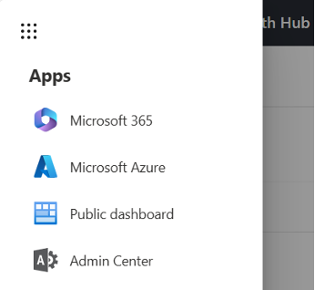
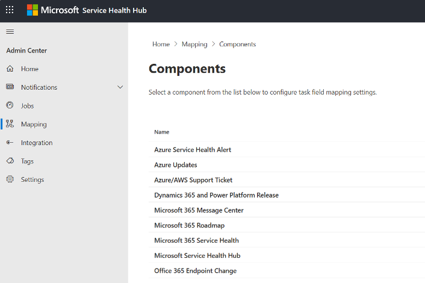

# Microsoft Service Health Hub Admin Center

Configuration of Microsoft Service Health Hub is performed within the Admin Center.

To access the Admin Center:

1. Open the Azure portal in your web browser:

   <https://portal.azure.com>

2. Open the **Service Health Hub resource group**.

3. Open the **App Service** resource.

4. Select the link under **Default domain** to open the app in the browser.

   Alternatively, take the value of the `$deployment.WebAppName` property, add `.azurewebsites.net`, and open the resulting URL in the browser.

5. In **Service Health Hub**, select the menu in the upper-left corner, and then select **Admin Center**.



## Configure general system settings

In the Service Health Hub Admin Center, select **Settings** in the left navigation.

On the **Application settings** page, configure the following items.

### Azure Translation integration

1. In a separate browser tab, open the Service Health Hub resource group.

2. Open the **Translator** resource.

   The resource name is stored in the deployment object:

   ```powershell
   $deployment.TranslatorName
   ```

3. Under **Resource Management**, select **Keys and Endpoint**.

4. Copy one of the keys and the value of **Location/Region**.

5. In the **Application settings** page in the Service Health Hub Admin Center, activate the **Azure Translation** switch.

6. Paste the copied values into the following fields:

   - **Resource location**
   - **Subscription key**

### Language service integration

1. In a separate browser tab, open the Service Health Hub resource group.

2. Open the **Language service** resource.

   The resource name is stored in the deployment object:

   ```powershell
   $deployment.LanguageServiceName
   ```

3. Under **Resource Management**, select **Keys and Endpoint**.

4. Copy one of the keys and the value of the **Endpoint** field.

5. In the **Application settings** page in the Service Health Hub Admin Center, activate the **Language service** switch.

6. Paste the copied values into the following fields:

   - **Endpoint**
   - **Subscription key**

### Service Health Hub Release Manager

Paste the following URL into the **Release manager endpoint** field:

<https://releasemanager.mycommunicationshub.com/api/public/releasemanager>

After configuring the settings, scroll to the bottom of the page and select **Save**.

## Configure field mapping for Azure DevOps work items

The mapping definition is currently stored as a series of JSON objects, one per data source.

Mapping definitions contain the relationship between metadata from the Service Health Hub data sets and Azure DevOps work items. In simpler terms, the mapping defines which data is written to which field in a work item.

These definitions can be accessed and modified in the Service Health Hub Admin Center under **Mapping**.



If Azure DevOps was configured as described in **Create an Azure DevOps process**, configuring the mapping is straightforward:

1. Open the folder with the extracted Service Health Hub deployment package.

2. Open the **Azure DevOps Mapping** folder.

   This folder contains a series of JSON files.

3. Open the **Service Health Hub Admin Center**.

4. Select **Mapping** in the left navigation bar.

   A list of components, also referred to as data sources, is displayed.

5. For each component in the list, select its name.

   This opens an editor.

6. Find the corresponding JSON file in the **Azure DevOps Mapping** folder.

7. Open the JSON file, copy its contents, and paste the contents into the editor in the Service Health Hub Admin Center.

8. Select **Save**.

The mapping contains one definition per work item field.

The following properties are used.

| Property | Description |
|---|---|
| `Name` | Describes the information handled by the mapping. This property is informational only. |
| `EntityProperty` | Name of the source property. This can include data such as ID, title, description, and other values. Available entity properties differ between data sources. |
| `Destination` | Internal work item field name. This field receives the value of the `EntityProperty`. |
| `IncludeForCreate` | If set to `true`, the field data is included when the work item is created. In some cases, this should be set to `false`. For example, a work item ID cannot be included during work item creation because it does not exist yet. |
| `IncludeForUpdate` | If set to `true`, the field data is included when the work item is updated. In some cases, this should be set to `false`. For example, you may decide to set a work item description only when the work item is created. |

Finding available entity properties is not yet as  of configuration.

For now, you can find available entity properties in the Azure Function:

1. Open the **Azure Function** resource.

2. Open **App Service Editor**.

3. Navigate to:

   ```text
   Modules/EntityMapping
   ```

4. Open the relevant `.psm1` file.

5. Find the `Initialize()` method.

   The list of available properties is located at the end of the method.

> **NOTE**: 
> You usually do not need to edit the mapping definitions unless additional properties are introduced.

---

**Previous:** [Configure Azure Function](./azure-function.md)

**Next:** [Configure notification routing](./notification-routing.md)