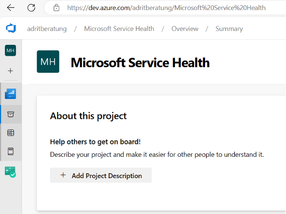

# Azure Function configuration

Now that all required components have been created, deploy the solution as an Azure Function.

Azure Functions is an event-driven, compute-on-demand experience that extends the Azure application platform. It enables code to run when triggered by events occurring in Azure, third-party services, or on-premises systems.

For Microsoft Service Health Hub, the Azure Function resource contains the logic for all background processes. These processes are triggered either on a schedule by timer triggers or by incoming events through HTTP triggers.

## Obtain the Azure DevOps organization URI and project name

To obtain the Azure DevOps organization URI:

1. Select **Azure DevOps** to open the **Projects** page.

2. Open the project created in the **Create an Azure DevOps project** step.

3. Note the URL from the address bar, including the trailing slash.

   The URL has the following format:

   ```text
   https://dev.azure.com/<organization>/project/
   ```

   Copy the following values:

   - **Azure DevOps organization URI**
   - **Project name**

   The organization URI is the part before the project name.

   Example:

   ```text
   https://dev.azure.com/contoso/
   ```

   The project name is the final segment of the URL.
   

## Add the Azure DevOps organization URI and project name to the Azure Function configuration

To update the Azure Function configuration:

1. Start the browser and navigate to:

   <https://portal.azure.com/#view/HubsExtension/BrowseResourceGroups>

2. Find your resource group and select its name to open it.

3. Find the Azure Function resource in the list and select its name to open it.

   The name is stored in the deployment object:

   ```powershell
   $deployment.FunctionAppName
   ```

4. Under **Settings**, select **Environment variables**.

   If **Environment variables** is not available, select **Configuration**.

5. In the list of **Application settings**, select **AzureDevOps.Organization** and update the value with the Azure DevOps organization URI collected in the previous step.

6. Select **AzureDevOps.Project** and update the value with the Azure DevOps project name collected in the previous step.

7. Apply the changes:

   - If you are on the **Environment variables** page, scroll to the end of the page and select **Apply**.
   - If you are on the **Configuration** page, select **Save** in the top command bar.

## Validate Azure DevOps work item type mapping in Azure Function configuration

To validate the Azure Function configuration:

1. Start the browser and navigate to:

   <https://portal.azure.com/#view/HubsExtension/BrowseResourceGroups>

2. Find your resource group and select its name to open it.

3. Find the Azure Function resource in the list and select its name to open it.

   The name is stored in the deployment object:

   ```powershell
   $deployment.FunctionAppName
   ```

4. Under **Settings**, select **Environment variables**.

   If **Environment variables** is not available, select **Configuration**.

5. In the list of **Application settings**, verify that the `AzureDevOps.WorkItemType.*` keys point to the correct work item types in Azure DevOps.

   These work item types were created in the **Create an Azure DevOps process** step.

| Key | Description / data source |
|---|---|
| `AzureDevOps.WorkItemType.AzureServiceHealthAlert` | Azure Service Health Alert |
| `AzureDevOps.WorkItemType.AzureUpdate` | Azure Update |
| `AzureDevOps.WorkItemType.D365PowerPlatformRelease` | Dynamics 365 and Power Platform Release |
| `AzureDevOps.WorkItemType.Office365EndpointsChange` | Office 365 Endpoint change |
| `AzureDevOps.WorkItemType.ReleaseMessage` | Microsoft Service Health Hub Release |
| `AzureDevOps.WorkItemType.RoadmapCommunication` | Microsoft 365 Roadmap |
| `AzureDevOps.WorkItemType.ServiceHealthIssue` | Microsoft 365 Service Health |
| `AzureDevOps.WorkItemType.ServiceUpdateMessage` | Microsoft 365 Message Center |

---

**Previous:** [Create incoming webhooks](../teams/create-incoming-webhooks.md)

**Next:** [Service Health Hub Admin Center settings](./admin-center-settings.md)