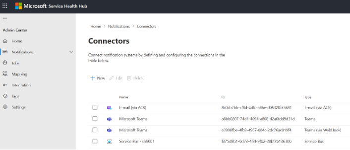
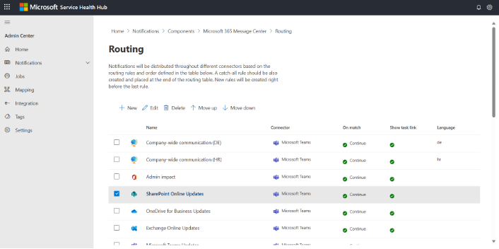
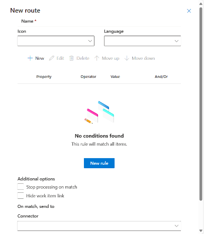
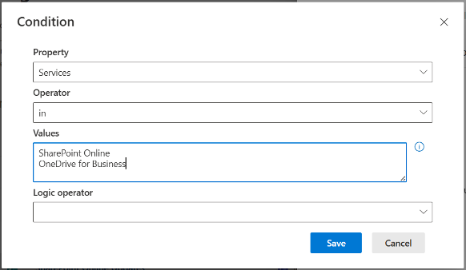
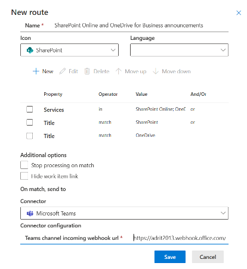

## Notification connectors

The first step is to create a notification connector.

A system connector for **Microsoft Teams via webhook** is created during deployment. If you only need Microsoft Teams integration, you do not need to create another connector.

To view existing connectors or register a new one, open:

**Service Health Hub Admin Center** > **Notifications** > **Connectors**

Service Health Hub supports the following connector types:

| Connector | Description |
|---|---|
| **Microsoft Teams via webhook** | Provides integration with Microsoft Teams through a Power Automate incoming webhook workflow. |
| **E-Mail via ACS** | Provides email functionality. An Azure Communication Services instance is required. |
| **Service Bus** | Provides integration with Azure Service Bus. You can use the notification infrastructure to send messages to Service Bus queues and automatically start Power Automate flows, Logic Apps, or Azure Functions. |

> **NOTE:** 
> This section will be extended with guidance for creating and configuring Azure Communication Services and Service Bus instances, and for configuring additional notification connectors.
>
> For now, this guide focuses on Microsoft Teams integration.

## Configure notification routing

Notification routing is defined per data source.

To configure notification routing:

1. Open **Service Health Hub Admin Center**.
2. Go to **Notifications** > **Routing**.
3. In the list of components, also referred to as data sources, select the component for which you want to configure notification routing.

This opens the routing configuration for the selected data source.

A data source can contain multiple routing rules. Rules are processed in the order in which they appear in the list.

### Create a routing entry

To create a routing entry:

1. Select **New** in the command bar.
2. Configure the routing entry in the panel that opens.

A route contains the following parameters:

| Parameter | Description |
|---|---|
| **Name** | Name of the routing entry. This is informational only. Recommended value: the name of the target Teams channel. |
| **Icon** | Icon used in the adaptive card, for example a service or product logo. |
| **Language** | Notification language. If set, the notification is translated into the specified language. Leave empty to use the original content. |
| **Conditions** | List of conditions that must be met for the communication to match the rule. You can use one or more conditions and combine them with `and` / `or` logical operators. |
| **Stop processing on match** | Rules are processed in the order in which they appear in the routing list. If this option is selected and the rule matches, the notification is sent to the selected connector and no further rules are processed. This is used only in specific cases. |
| **Hide work item link** | Adaptive cards in Teams show a work item button at the bottom, linking to the task created for the communication. Select this option when the target audience should not see the work item link, for example if they do not have access to Azure DevOps. |
| **Connector** | Connector to which Service Health Hub sends the notification when the rule matches. |

Connector-specific configuration depends on the connector type:

| Connector | Configuration |
|---|---|
| **Teams via webhook** | Incoming webhook workflow URL. See **Teams configuration** > **Creating incoming webhooks**. |
| **E-Mail via ACS** | List of recipients, separated by semicolons. |
| **Service Bus** | Name of the target Service Bus queue. |

### Configure conditions

To configure conditions:

1. In the route panel, select **New** in the command bar.
2. Configure the condition in the dialog box.

A condition contains the following parameters:

| Parameter | Description |
|---|---|
| **Property** | Entity property used for matching, for example `Services`. |
| **Operator** | Operator used for matching. |
| **Value / Values** | Value to check for. For some operators, you can enter multiple values, one per line. |
| **Logic operator** | `and` or `or`. Used only when additional conditions are added afterwards. |

The following operators are supported:

| Type | Operator | Comparison test |
|---|---|---|
| Equality | `==` | equals |
| Equality | `<>` | not equals |
| Equality | `>` | greater than |
| Equality | `>=` | greater than or equal |
| Equality | `<` | less than |
| Equality | `<=` | less than or equal |
| Matching | `like` | string matches wildcard pattern |
| Matching | `notlike` | string does not match wildcard pattern |
| Matching | `match` | string matches regex pattern |
| Matching | `notmatch` | string does not match regex pattern |
| Containment | `contains` | collection contains a value |
| Containment | `notcontains` | collection does not contain a value |
| Containment | `in` | value is in a collection |
| Containment | `notin` | value is not in a collection |

### Example routing rule

The following example routes Microsoft 365 Message Center communications that match either of these conditions:

- The communication affects **SharePoint Online** or **OneDrive for Business**.
- The communication title contains **SharePoint** or **OneDrive**.

### Tips for defining routing rules

1. **Create a catch-all rule**

   Define a catch-all target, for example a Teams channel, and create a catch-all rule without conditions.

   Place this rule at the bottom of the routing list. It is used when no other rule matches.

   You can define all other routing rules afterwards. The UI creates new rules between the last and second-last rule.

2. **Validate property values**

   Available values depend on the selected data source.

   A practical approach is to run an initial synchronization and review the communications in the catch-all channel and the created Azure DevOps work items.

   Useful references:

   - For Microsoft 365 Message Center and Service Health, review the communications in the Microsoft 365 admin center or in the Service Health Hub web app.
   - For Microsoft 365 Roadmap, open <https://www.microsoft.com/en-us/microsoft-365/roadmap> and use filters to identify possible values.
   - For Dynamics 365 and Power Platform Release Planner, open <https://releaseplans.microsoft.com>.
   - For Azure Updates, open <https://azure.microsoft.com/en-us/updates>.

3. **Use the `in` operator where possible**

   The `in` operator makes conditions easier to maintain.

   For example, if a service name changes, you can include both the old and new service names and match both values with one condition.

---

**Previous:** [Service Health Hub Admin Center settings](./admin-center-settings.md)

**Next:** [Configure admin notifications](./admin-notifications.md)