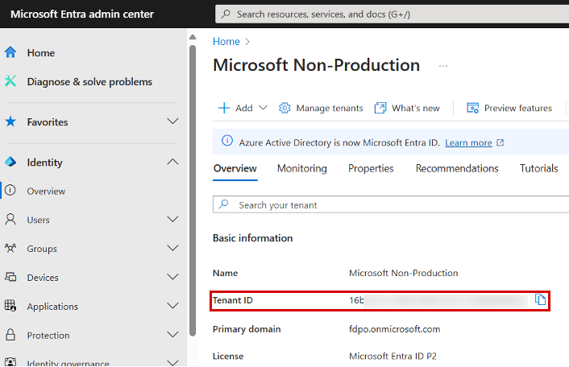
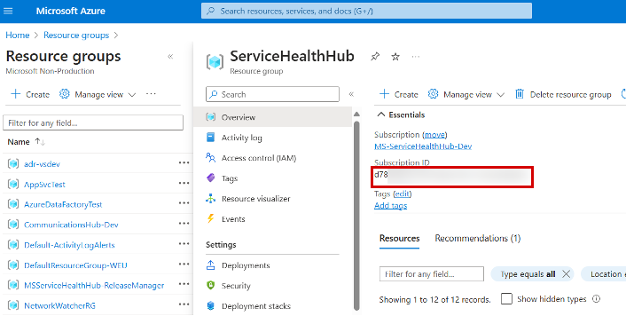
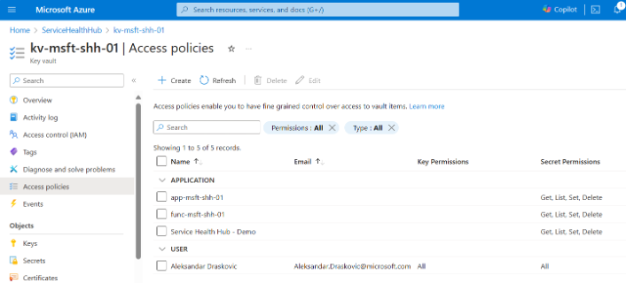
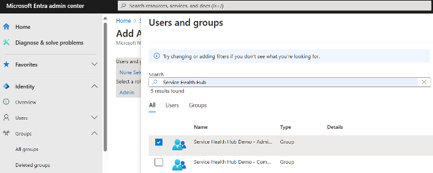
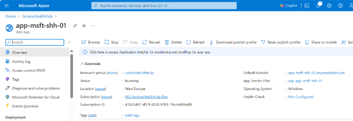

# Deploy Microsoft Service Health Hub Resources

## Introduction

Microsoft Service Health Hub requires the following Azure resources. These resources are deployed automatically by running the deployment script.

- Microsoft Entra ID App Registration
- Microsoft Entra ID Enterprise Application
- App Service
- Application Insights
- App Service Plan
- Function App
- Key Vault
- Language Service
- Log Analytics Workspace
- SQL Server
- SQL Database
- Storage Account
- Azure Translator

## Run the Deployment Script

Perform the following steps to deploy the Microsoft Service Health Hub resources.

### 1. Obtain the Tenant ID

1. Open the Microsoft Entra admin center:

   [Microsoft Entra Admin Center](https://entra.microsoft.com/#view/Microsoft_AAD_IAM/TenantOverview.ReactView)

2. Verify that the correct tenant is selected.

   > If necessary, select your profile in the upper-right corner and choose **Switch directory**.

3. Copy the **Tenant ID**.


### 2. Obtain the Resource Group Name and Subscription ID

1. Open the Azure portal:

   [Azure Resource Groups](https://portal.azure.com/#view/HubsExtension/BrowseResourceGroups)

2. Open the target resource group.

3. Copy the **Resource Group Name**.

4. In the **Essentials** section, copy the **Subscription ID**.


### 3. Extract the Deployment Package

1. Download and extract the Microsoft Service Health Hub deployment package.
2. Open **PowerShell 7**.
3. Change to the folder containing the extracted deployment files.

### 4. Run the Deployment

> After the deployment completes successfully, **do not close the PowerShell session**, as the deployment object will be reused for Azure DevOps process configuration.

Replace the placeholder values and run the following script:

```powershell
using module .\ServiceHealthHubDeployment.psm1

$tenantId = "<insert-your-tenant-id>"
$subscriptionId = "<insert-your-subscription-id>"
$rgName = "<insert-your-resource-group-name>"
$appRegName = "<insert-entra-app-registration-name>"
$instanceName = "<insert-service-health-hub-instance-name>"

$deployment = :new(
    $tenantId,
    $subscriptionId,
    $rgName,
    $appRegName,
    $instanceName
)

$deployment.Run()
```

## PowerShell Variable Overview

The deployment script uses the following variables.

| Variable | Description |
|-----------|-------------|
| `$tenantId` | The Microsoft Entra tenant ID where Service Health Hub will be deployed. |
| `$subscriptionId` | The Azure subscription ID where Service Health Hub resources will be deployed. |
| `$rgName` | The Azure resource group that will contain all deployed resources. Resources are created in the same Azure region as the resource group. |
| `$appRegName` | The display name of the Microsoft Entra App Registration and Enterprise Application created during deployment. The application must not already exist. |
| `$instanceName` | A unique instance identifier used in Azure resource naming. Resource names follow the pattern `prefix-instancename`. The value must be lowercase and fewer than 20 characters. |

For Azure naming conventions and abbreviations, see:

https://learn.microsoft.com/en-us/azure/cloud-adoption-framework/ready/azure-best-practices/resource-abbreviations

## Post-Deployment Steps

After the deployment completes successfully, perform the following configuration steps.

### Grant Admin Consent

Grant tenant-wide admin consent for the API permissions assigned to the application.

1. Open **Microsoft Entra Admin Center**.
2. Navigate to:

   **Applications** → **App registrations** → **All applications**

3. Search for the deployed application.
4. Open the application registration.
5. Select **API permissions**.
6. Click **Grant admin consent**.

### Verify Key Vault Access Policies

1. Open the Service Health Hub resource group.
2. Open the deployed **Key Vault**.
3. Select **Access policies**.

4. Verify that access policies exist for:

   - App Service (`$deployment.WebAppName`)
   - Function App (`$deployment.FunctionAppName`)
   - App Registration (`$deployment.AppName`)

Each identity must have the following secret permissions:

- Get
- List
- Set
- Delete

> If any policy or permission is missing, add it manually.

### Create Security Groups and Assign Application Roles

#### Create Security Groups

1. Open the Microsoft Entra admin center:

   [Microsoft Entra Admin Center](https://entra.microsoft.com)

2. Navigate to:

   **Applications** → **App registrations** → **All applications**

3. Search for the deployed application using:
   - `$deployment.AppName`
   - `$deployment.AppId`

4. Open the application registration.
5. Select **App roles**.
6. Record all configured application roles.

7. Navigate to:

   **Groups** → **All groups**

8. Create one **Security Group** for each application role.

#### Assign Roles to Groups

1. Return to the application registration.
2. On the **Overview** page, click the link under **Managed application in local directory**.
3. In the Enterprise Application, select:

   **Users and groups**

4. For each application role:

   1. Select **Add user/group**
   2. Select the role
   3. Assign the corresponding security group
   

### Restart the App Service

1. Open the Service Health Hub resource group.
2. Open the deployed **App Service**.
3. Select **Restart**.
4. After the restart completes, click the **Default Domain** link.

If the application loads successfully, the deployment is complete and you can continue with Microsoft Service Health Hub configuration.


---

**Previous:** [Prerequisites](../prerequisites/prerequisites.md)

**Next:** [Azure DevOps Project](../azure-devops/introduction.md)