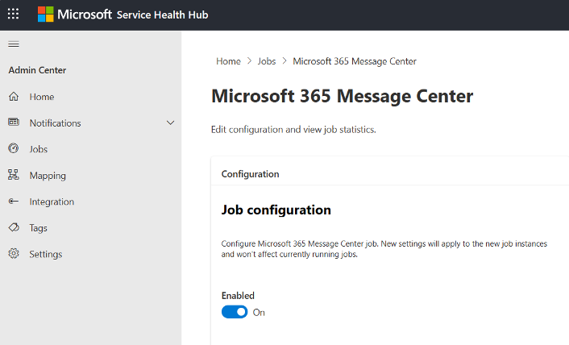

# Enable Service Health Hub jobs

After the initial deployment and configuration, jobs must be enabled in two places:

- Service Health Hub Admin Center
- Azure Function

## Service Health Hub Admin Center

To enable jobs in the Service Health Hub Admin Center:

1. Open **Service Health Hub Admin Center**.
2. Go to **Jobs**.

   This opens a list of data sources.

3. Select each data source.
4. Enable the **Enabled** toggle.



## Azure Function

To enable functions within the Azure Function App:

1. Start the browser and navigate to:

   <https://portal.azure.com/#view/HubsExtension/BrowseResourceGroups>

2. Find your resource group and select its name to open it.

3. Find the **Function App** resource in the list and select its name to open it.

   The name is stored in the deployment object:

   ```powershell
   $deployment.FunctionAppName
   
4. In the Overview page, you will see a list of functions. For each function, make sure that the function is enabled. To enable a function, open the context menu (ellipsis at the right side) and click Enable. Jobs will run now on schedule. 


---

**Previous:** [Configure admin notifications](../configuration/admin-notifications.md)

**Next:** [Appendix A - A sample list of teams and channels](../appendix/appendix-a-sample-list-of-teams-channels.md)